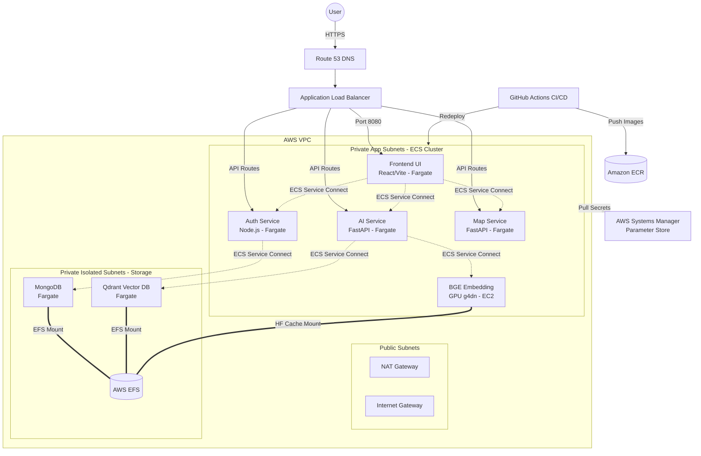

# AI First-Aid Assistant - Infrastructure 🚀

This repository contains the completely automated Terraform Infrastructure as Code (IaC) and GitHub Actions CI/CD pipelines for deploying the **AI First-Aid Assistant** to AWS.

## 🌐 Live URL
👉 **https://medaid.abdallahgabr.me**

## 🏗️ Cloud Architecture

The application is deployed on **AWS (eu-central-1)** using a highly available, secure, and scalable microservices architecture. 

### Architecture Diagram

## 🛠️ Infrastructure Components

### Compute (Amazon ECS)
- **AWS Fargate**: Serverless compute used for the Frontend, Auth, AI, Map, MongoDB, and Qdrant tasks to minimize overhead.
- **ECS on EC2 (g4dn.xlarge)**: Provisioned specifically for the **BGE Service** to utilize NVIDIA T4 GPUs for rapid LLM/embedding inference.
- **ECS Service Connect**: Provides internal DNS (`*.medaid.local`) for seamless inter-microservice communication without routing through the public internet.

### Networking (AWS VPC)
- **Public Subnets**: Houses the ALB and NAT Gateways.
- **Private App Subnets**: Houses all ECS compute containers. Outbound internet access is routed through the NAT Gateway.
- **Private Isolated Subnets**: Houses the EFS Mount Targets and Databases. No internet access for maximum security.
- **Application Load Balancer (ALB)**: Terminates SSL via ACM and routes incoming traffic to the correct ECS services using path-based and port-based routing.

### Storage & State
- **Amazon EFS**: Provides persistent, shared file storage for:
  - MongoDB Data (`/mongo/data`)
  - Qdrant Vector Storage (`/qdrant/storage`)
  - HuggingFace Models Cache (`/huggingface-cache` for the GPU)
- **Amazon ECR**: 5 private elastic container registries holding the built Docker images for each service.
- **AWS Systems Manager (SSM)**: Securely stores application secrets (JWT keys, API keys).

## 🚀 CI/CD Pipeline (GitHub Actions)
Deployments are fully automated. Pushing code to any microservice repository triggers the `deploy.yml` workflow which:
1. Checks out the code.
2. Authenticates with AWS securely.
3. Builds the Docker image.
4. Pushes to Amazon ECR.
5. Forces an ECS rolling update to seamlessly transition traffic to the new version with zero downtime.
